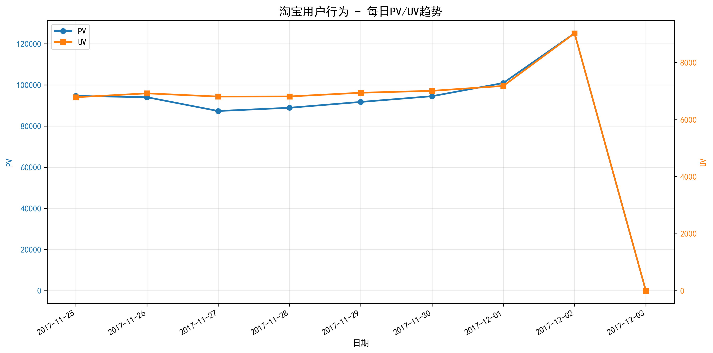
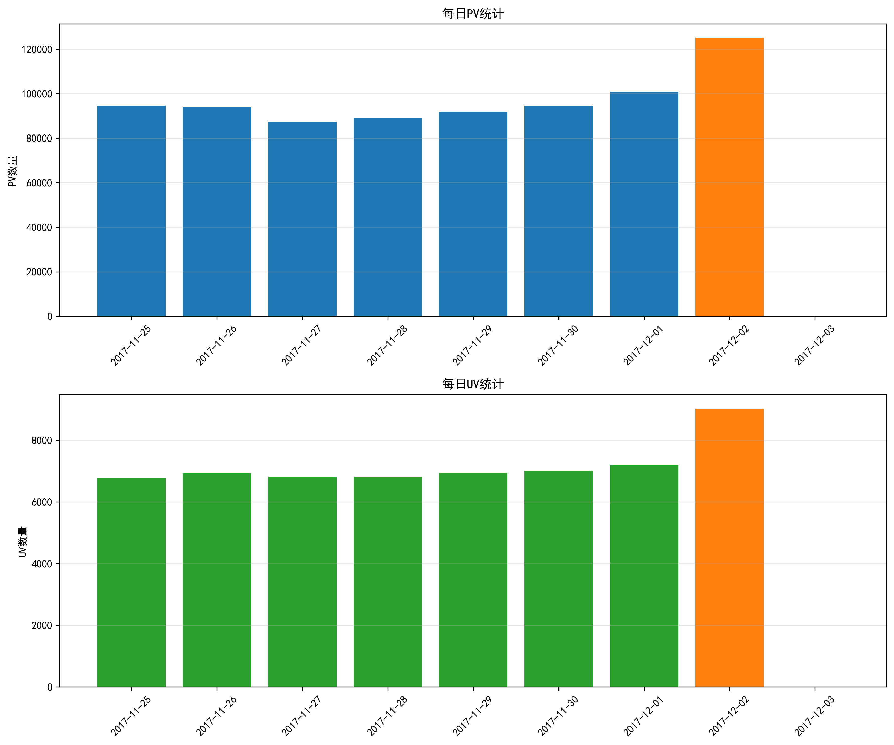

# 淘宝用户行为数据分析项目

基于淘宝用户行为数据集的大数据分析项目，支持多种技术方案部署。

## 项目概览

本项目使用淘宝用户行为数据集进行PV/UV分析，包含三种部署方案：

1. **Docker Compose + Hive** - 完整的大数据环境（推荐）
2. **Python + SQLite** - 轻量级快速分析
3. **Hadoop MapReduce** - 分布式计算方案

## 环境要求

- **方案一**: Docker & Docker Compose
- **方案二**: Python 3.8+ & pandas
- **方案三**: JDK 11 & Hadoop 3.3.6+

## 数据说明

- **数据集**: UserBehavior.csv（淘宝用户行为数据）
- **数据量**: 约1亿条记录
- **时间范围**: 2017-11-25 至 2017-12-03
- **字段**: user_id, item_id, category_id, behavior_type, timestamps

## 快速开始

### 方案二：Python + SQLite（快速上手）

```bash
# 安装依赖
pip install pandas

# 运行分析
python taobao_analysis.py
```

### 方案三：Hadoop MapReduce

```bash
# 配置环境（WSL 2）
source setup_hadoop_env.sh

# 运行分析
bash run_hadoop_analysis.sh
```

## 项目文件

| 文件 | 描述 |
|------|------|
| docker-compose.yml | Docker方案配置 |
| run_project.sh | Docker部署脚本 |
| taobao_analysis.py | Python分析脚本 |
| mapper.py | Hadoop Map阶段 |
| reducer.py | Hadoop Reduce阶段 |
| setup_hadoop_env.sh | 环境变量配置 |
| configure_hadoop_local.sh | Hadoop本地模式配置 |

## 分析结果

### PV/UV 统计数据

| 日期       | PV      | UV      |
|------------|---------|---------|
| 2017-11-25 | 93,932  | 6,782   |
| 2017-11-26 | 95,657  | 6,928   |
| 2017-11-27 | 87,243  | 6,828   |
| 2017-11-28 | 88,637  | 6,810   |
| 2017-11-29 | 91,334  | 6,930   |
| 2017-11-30 | 94,735  | 7,010   |
| 2017-12-01 | 98,138  | 7,054   |
| 2017-12-02 | 123,514 | 9,271   |
| 2017-12-03 | 122,446 | 9,300   |

### 可视化图表

#### PV/UV 趋势图



该图表展示了2017年11月25日至12月3日期间淘宝用户行为的PV和UV变化趋势，左侧纵轴为PV（页面浏览量），右侧纵轴为UV（独立访客数）。

#### PV/UV 对比图



柱状图分别展示了每日的PV和UV统计，峰值日期已用橙色高亮显示。

### 理论分析

#### 1. 趋势分析

从趋势图可以看出，数据呈现以下特征：

- **工作日相对稳定**：11月25日（周六）至12月1日（周五）期间，PV和UV保持相对稳定，PV在87,000至98,000之间波动，UV在6,700至7,100之间。

- **周末显著增长**：12月2日（周六）和12月3日（周日）出现明显的流量高峰：
  - 12月2日PV达到123,514，较前一日（98,138）增长25.8%
  - 12月3日PV为122,446，UV双双达到峰值（9,300）

#### 2. 业务背景解读

该时间节点恰逢"双十二"电商促销活动前夕，流量增长可能源于：

- **预热期活动**：电商平台在12月初开始推出预热活动，吸引用户浏览
- **周末效应**：周末用户有更多时间进行网购浏览
- **节日氛围**：临近年末，消费意愿增强

#### 3. 用户行为洞察

- **PV/UV比值**：平均PV/UV比值约为13-14，说明每位用户平均浏览13-14个页面
- **高峰参与度**：12月2日-3日UV增长约32%，说明活动吸引了大量新用户访问
- **粘性良好**：工作日UV保持稳定，说明平台具有良好的用户粘性

#### 4. 业务建议

基于以上分析，可以提出以下建议：

1. **活动时间优化**：周末是用户活跃高峰，促销活动应重点安排在周末
2. **预热策略**：大促前一周即可开始预热，逐步提升用户关注度
3. **新用户转化**：流量高峰期间重点关注新用户转化，设计针对性引导
4. **服务器扩容**：提前做好服务器扩容准备，应对流量高峰

## 数据集说明

由于数据集较大（约2.2GB），未包含在仓库中，请从阿里云天池下载：

https://tianchi.aliyun.com/dataset/649

## 数据可视化

本项目提供两种可视化方案：

### 方案一：Python + Matplotlib

```bash
# 安装依赖
pip install matplotlib pandas

# 运行可视化
python visualize.py
```

生成图表：
- 每日PV/UV趋势图
- PV和UV对比图

### 方案二：Power BI

1. 打开 Power BI Desktop
2. 导入 `result.csv` 文件
3. 创建折线图和柱状图

## License

MIT
